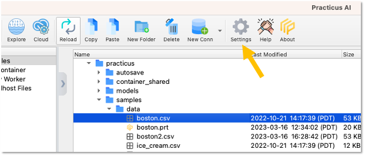
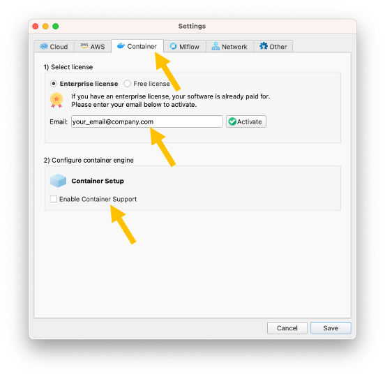
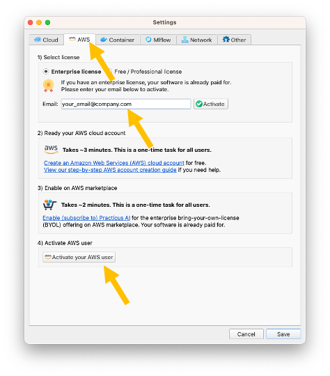

Practicus AI App is **forever free** without any limitations. For **advanced features** such as **AutoML**, you can use **Cloud Workers**.

Cloud Workers also offer a **free tier**, but with some limitations. Your Enterprise license will **unlock all advanced features**.   

## Activating your Enterprise License 

1) [Install the Practicus AI App](https://practicus.ai/get-started/)

2) Open App settings 

3) Pick one or more Cloud Worker (backend system) options. 

[View detailed comparison](https://practicus.ai/cloud/#compare)

**Container Quick Overview**

- Runs on your laptop
- **Pros**: Free
- **Cons**: You need to download Docker Desktop (free)
  
**AWS Marketplace Quick Overview** 
 
- Runs on your AWS account
- **Pros**: No need to download extra software 
- **Cons**: You pay for AWS cloud usage  

**Software as a Service**

- This option is not included in your trial. 
- Please [click here to start Practicus AI SaaS trial](https://practicus.ai/cloud/#saas) 

**Enterprise Kubernetes**

- This option is not included in your trial. 
- Please [contact us get Enterprise Cloud](https://practicus.ai/contact/) 

[View detailed comparison](https://practicus.ai/cloud/#compare)

4.a) Container Option: 

- Open Container tab in settings
- Enter your email and click **Activate**
- You will receive your license code as email. Please check your spam folder if you did not receive
- Click **Enable Container Support** and follow the steps to pull (download) Practicus AI container on your laptop

[View local container setup guide](setup-guide.md#local-container) 

4.b) AWS Marketplace Option: 

- Open AWS tab in settings
- Enter your email and click **Activate**. You can skip this step if you already activated for containers. Simply close and re-open App settings.
- You will receive your license code as email. Please check your spam folder if you did not receive
- Click **Activate your AWS user** button and follow the steps

[View AWS cloud marketplace setup guide](setup-guide.md#aws-marketplace) 

If you need any, help please [view the detailed setup guide](setup-guide.md) or [contact support](https://helpdesk.practicus.io/).

Thank you!