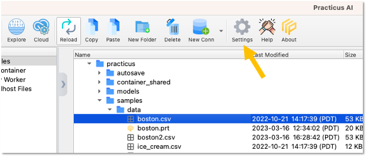
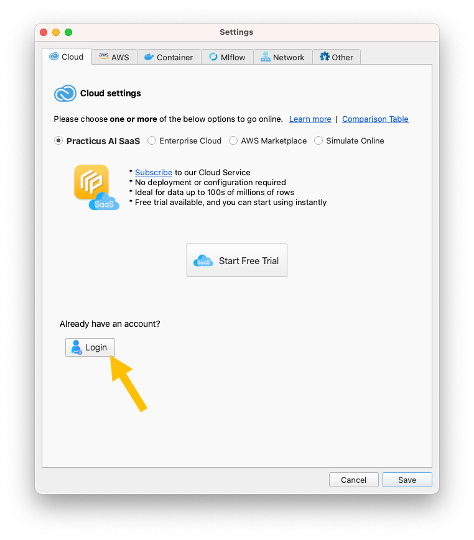
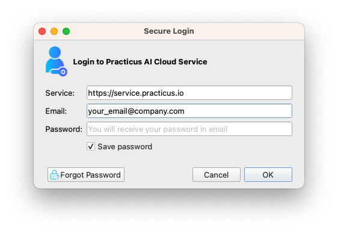

Practicus AI App is **forever free** without any limitations. For **advanced features** such as **AutoML**, you can use **Cloud Workers**.

Cloud Workers also offer a **free tier**, but with some limitations. Your SaaS account will **unlock all advanced features**.   

## Logging in to your SaaS account

1) [Install the Practicus AI App](https://practicus.ai/get-started/)

2) Open App settings 

3) Login to service

- Click **Login** button  

- Enter your email and password and click **OK**
- You should have received your password in email, please check your spam folder if you haven't
- To reset your password, click **Forgot Password**

If you need any, help please [view the detailed setup guide](setup-guide.md) or [contact support](https://helpdesk.practicus.io/).

Thank you!
