# Introduction to Advanced Model, Experiment, and Artifact Management in Practicus AI with MLFlow

The MLFlow integration of the Practicus AI platform provides a solution that significantly simplifies and optimizes the management process of your machine learning projects. 

This guide explains how to use model creation, management of experiments and other features MLFlow offers.

### Access to MLFlow Interface:

Within Practicus AI, to access MLFlow:

- Open Explore tab
- Select the MLFlow service defined for you in the working region
- You can see the models and experiments saved in MLFlow here

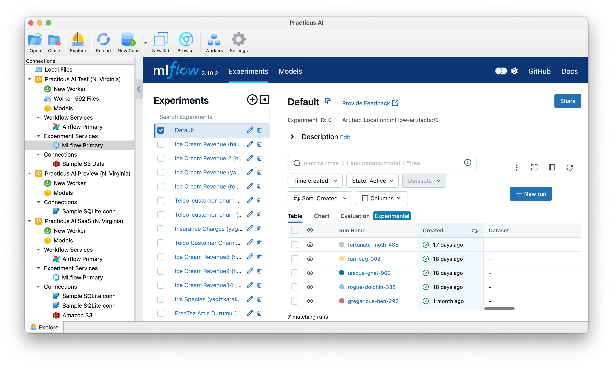

### Saving a created model in MLFLow

- Click on _Explore_ tab
- Make sure your Worker is already selected upper left
- Click _Worker Files_ to load content 
- Expand _samples_ folder and click on _ice_cream.csv_
- Click _Load_ 
- Click on the _Model_ button
- Click Advance
- Choose _Log Exp. Service_ as _MLFlow Primary_

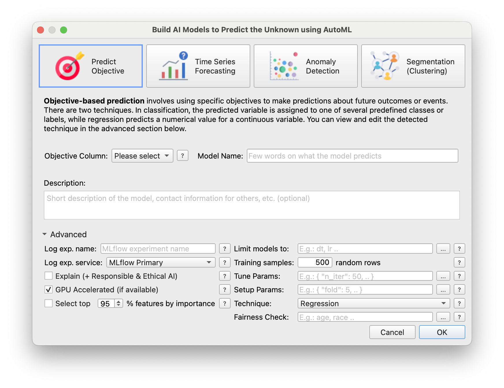

- Click OK
- When the model is created, a plugin will arrive and set the incoming plugin like this

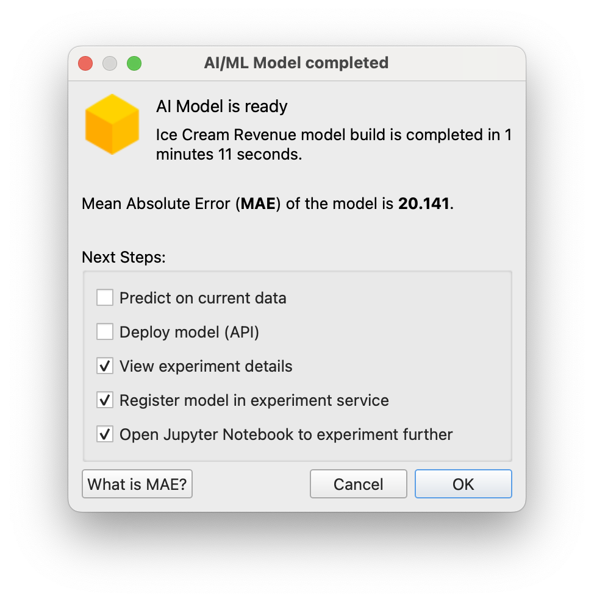

- Click OK

### Models, Experiments and Artifacts

- Open the opened MLFLow service in the browser from the tab above
- Find the session you created and open the session
- Here you can see the prt format file, the json containing the model's metadata and the pickle
- Click Parameters
 
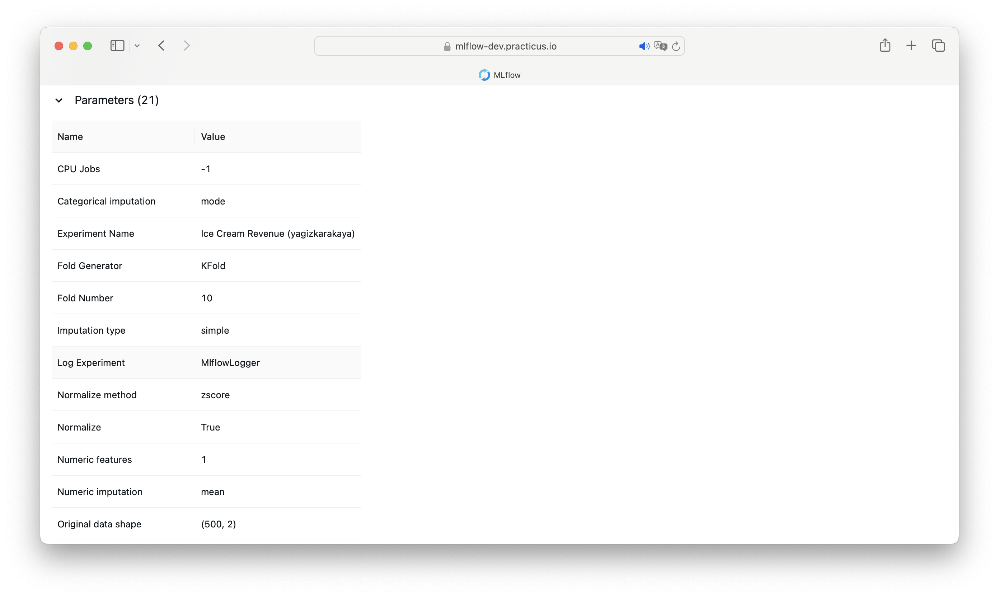

- Back to Session
- Find the session you created and click on the '+' sign under table

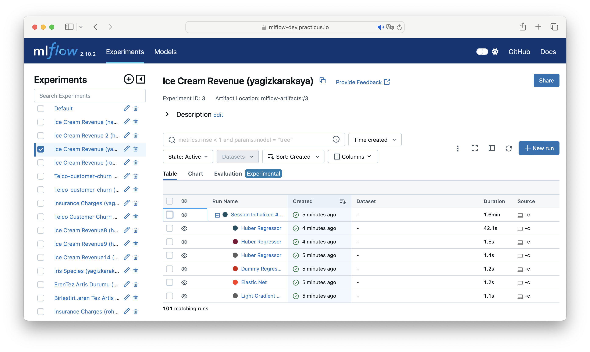

- Select the first model under session here

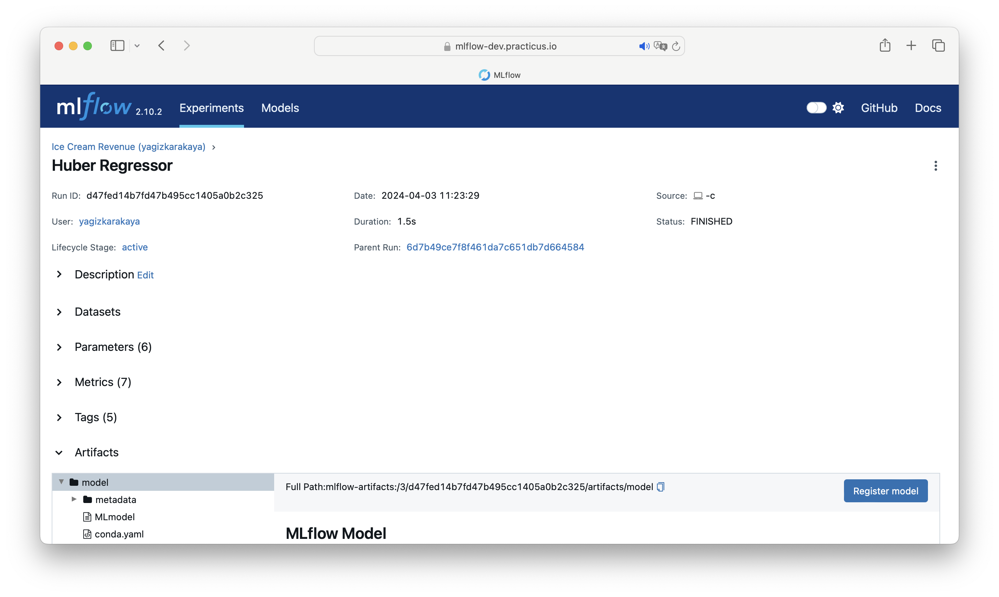

- Click on Metrics and see the error metrics saved in MLFlow:

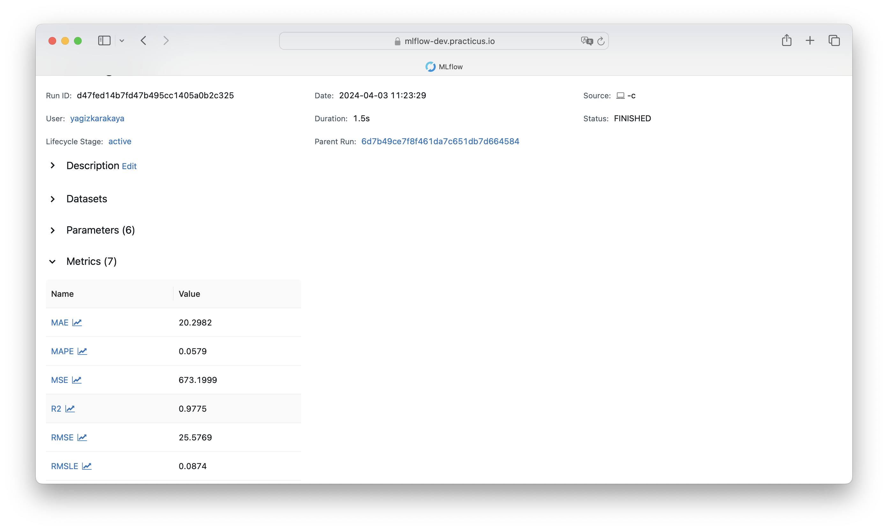

- Scroll to the bottom of the page and access the model artifacts

Scroll to the bottom of the page and access the model artifacts

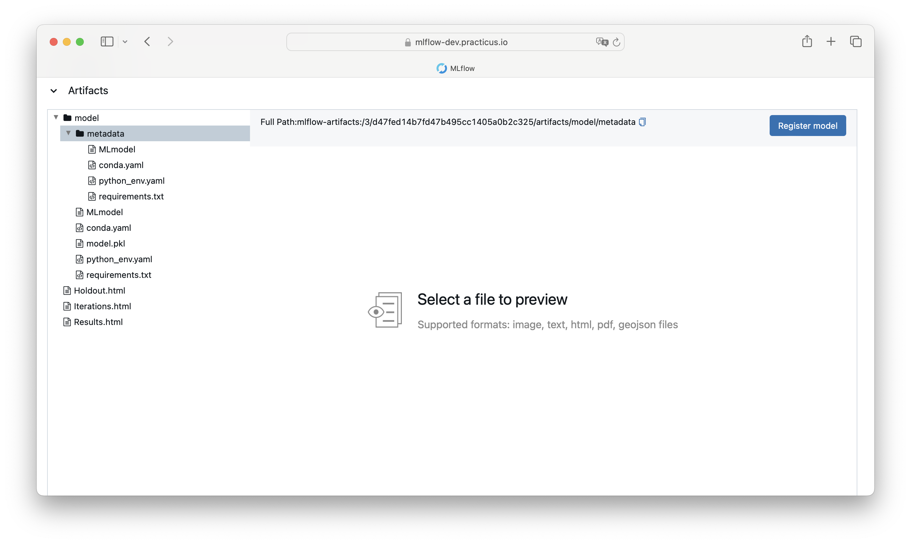

### Sending an Experiment from Notebook to MLFlow

- Back to Notebook opened after the model

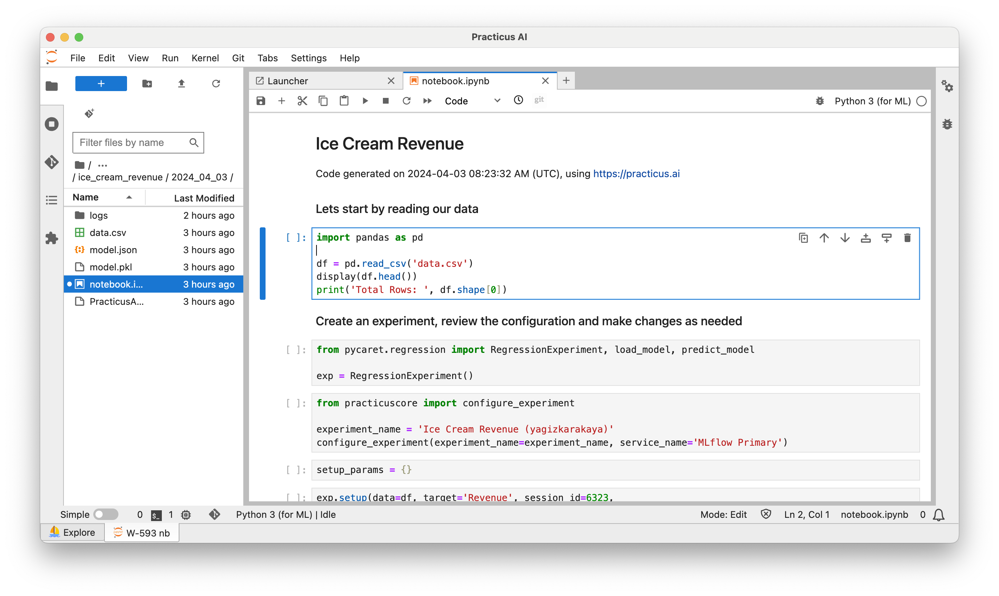

- Run step by step and create exp in step 3

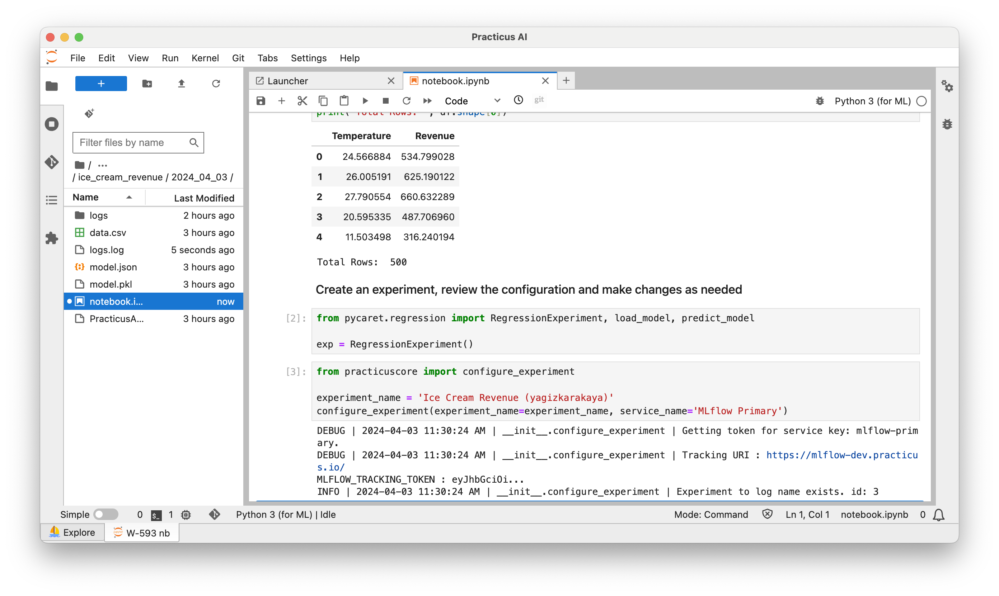

- Update setup params and run the cell

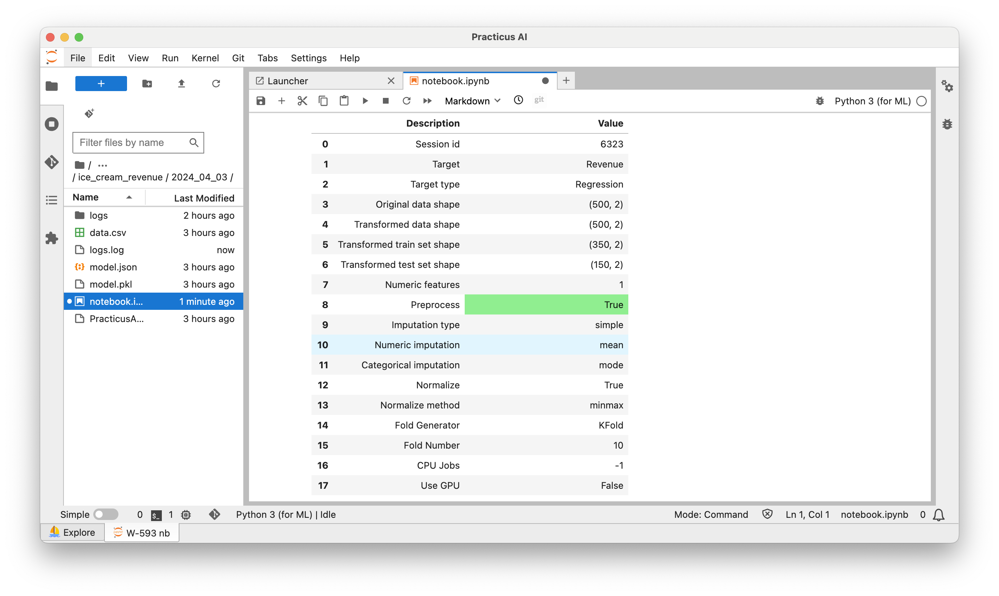

- Now you can setup experiments

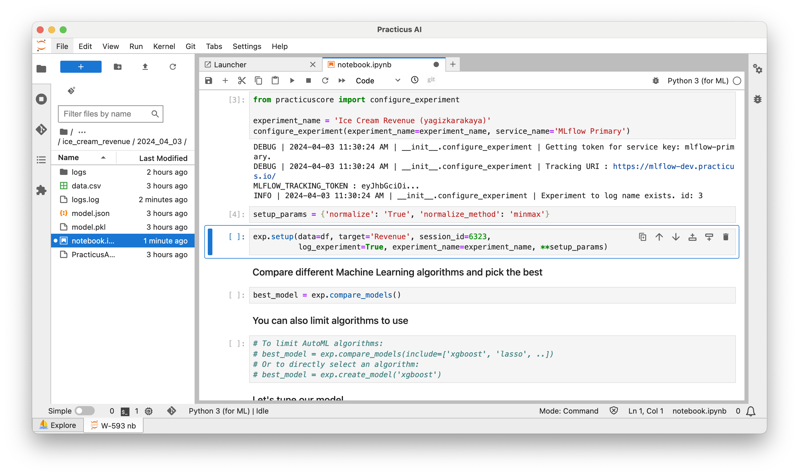

- Run the rest of the steps

- Save setup 
 
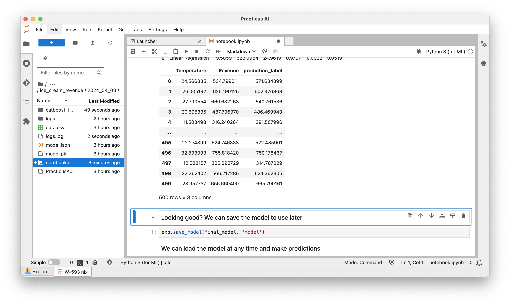

- Open MLFlow in the browser

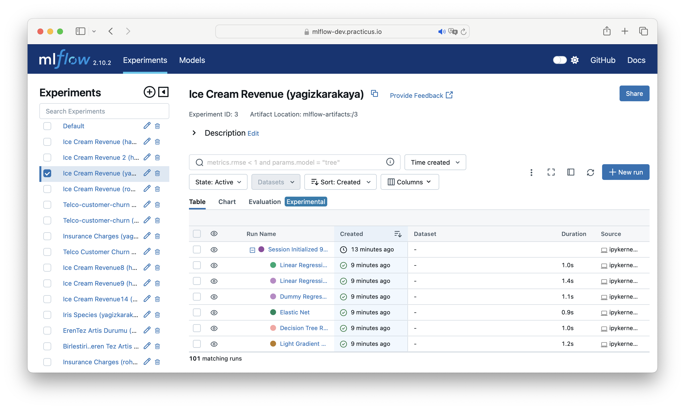

- Click on the new _Experiment_ and open it
- See the changes here

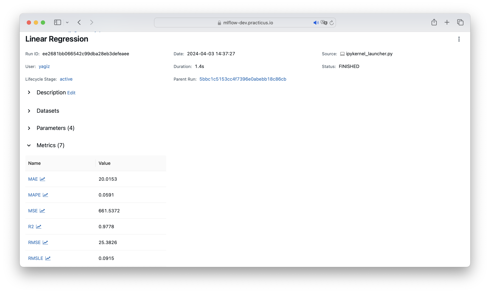
