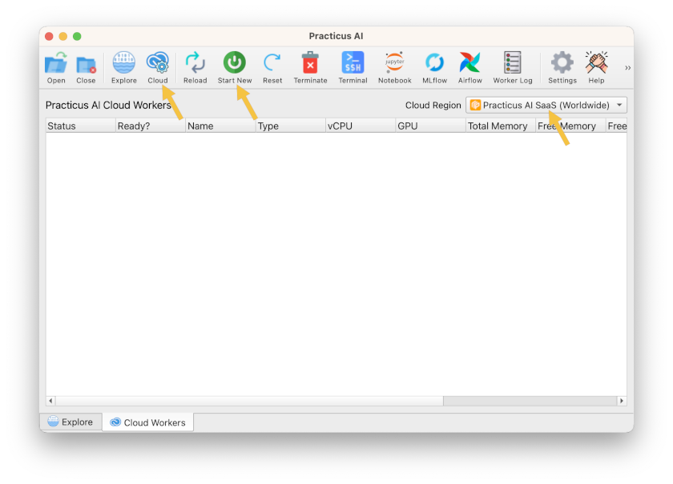

# Introduction to Practicus AI Cloud Nodes

Some Practicus AI features require to use the cloud. In this section we will learn how to use Practicus AI cloud nodes.

## Setup

If you haven't already, please check the [Setup Guide](../setup-guide.md) to learn how to configure Practicus AI cloud. 

You can use the free cloud tier for this tutorial, and it should take 2-5 minutes to complete the setup.

## What is a Cloud Node?

Practicus AI cloud nodes run in AWS cloud, and in your account fully isolated. You can think of them as on-demand computers that are already pre-configured to run AI workloads.

You can create as many cloud nodes as you need with different capacity. E.g. You can create one with 8GB RAM, and while you continue working, you can create another one with 16GB RAM. 

## Launching a new Cloud Node

- Click on the _Cloud_ button to open the _Cloud Nodes_ tab
- Make sure the selected the optimal _AWS Cloud Region_. The closest region geographically will usually give you the best internet network performance
- Click _Launch New_ 

- Pick the type (size) of your cloud node
- Click ok to launch 

The default size will be enough for most tasks. You can also choose the free cloud tier.

In a few seconds you will see your cloud node is launching, and in 1-2 minutes you will get a message saying your cloud node is ready.

## Stopping a Cloud Node

Similar to electricity, water, or other utilities, your cloud vendor (AWS) will charge you a fee for the hours your cloud node is running. Although Practicus AI cloud nodes automatically shut down after 90 minutes, it would be a practical approach to shut down your cloud nodes manually when you are done for the day.

For this, you can simply select a clod node and click on the _Stop_ button. The next day, you cna select the stopped cloud node, click _Start_ and continue where you are left.

Tip: It is usually not a good idea to frequently stop / start instances. Please prefer to stop if your break is at least a few hours for optimal cost and wait time.

## Terminating a Cloud Node

Practicus AI cloud nodes are designed to be disposable, also called ephemeral. You can choose a cloud node and click _Terminate_ to simply delete everything related to it.

Please be careful that if you choose to store data on the local disk of your cloud node, this will also get lost after termination. In this case you can prefer to copy your data manually, or simply click the _Replicate_ button before terminating a cloud node. 

## (Optional) Using Jupyter Lab

For technical users.

Every cloud node comes with some external services preconfigures, such as Jupyter Lab, Mlflow, Airflow.  

- Select a cloud node that is running and ready
- Click on Jupyter button

This will start the Jupyter Lab service and view inside the app. You can also right-click tab name and select _Open in browser_ to view the notebook on your default browser.

Notes: 

- If you shut down the app, the secure connection tunnel to the cloud node notebook service will be lost even if the cloud node continues to run.
- There are two separate Conda kernels configured for your notebook server. Big data one will have common libraries and data engines such as DASK, RAPIDS (if you have GPUs) and Spark installed. The ML one, as the name suggests, will have ML related libraries such as scikit-learn, Xgboost, Pycaret ..

## (Optional) Using the Terminal

For technical users.

You can choose a cloud node and click the _Terminal_ button to instantly open up the terminal. You have sudo (super-user) access and this can be a very powerful and flexible way to customize your cloud node.

[< Previous](data-prep-intro.md) | [Next >](explore.md)