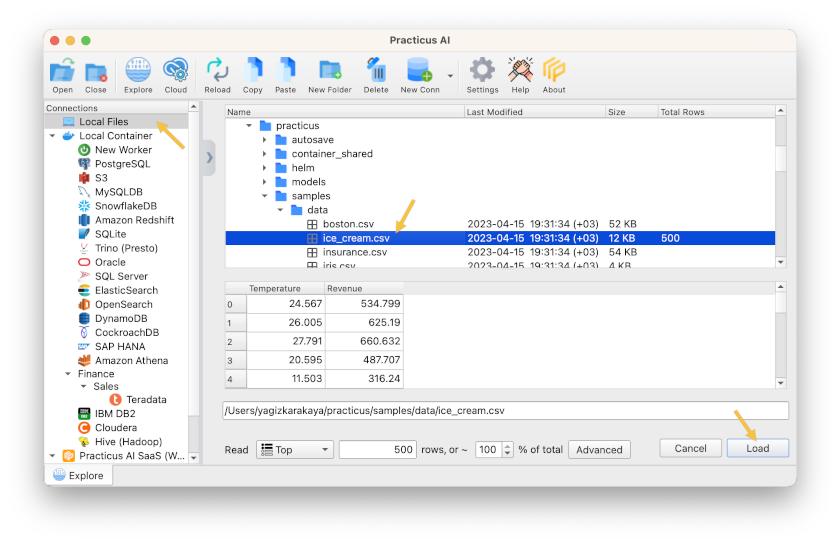
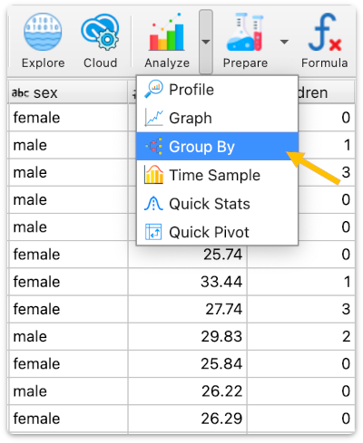
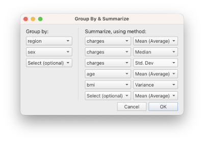

# Introduction to Data Analysis

_This section only requires Practicus AI app and can work offline._

Work in progress. Please check again tomorrow

## Visualizing Data

## Visualizing Outliers 

## Group by to Summarize Data

[< Previous](start.md) | [Next >](data-prep-intro.md)