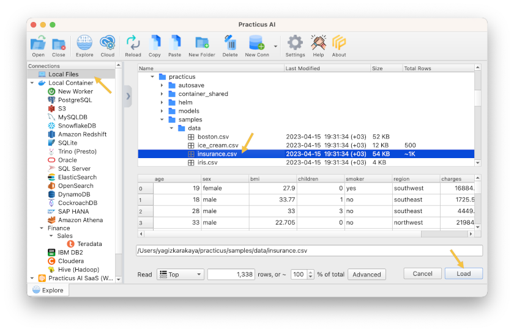
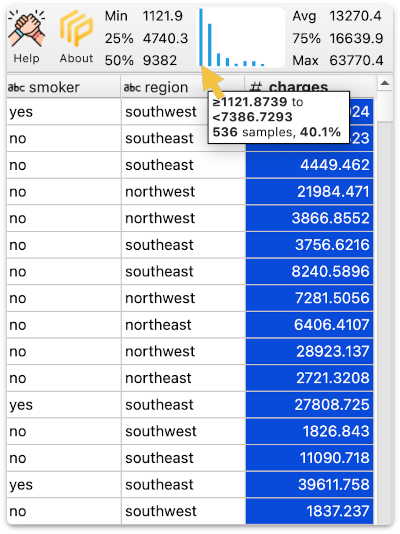
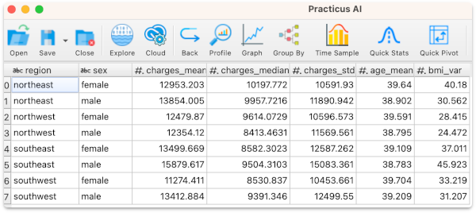

# Introduction to Data Analysis

_This section only requires Practicus AI app and can work offline._

## Working with local files
- Open Practicus AI app
- You will see the _Explore_ tab, click on _Local Files_
- Navigate to the samples directory and open ice_cream.csv : 
- home > practicus > samples > data > ice_cream.csv
- Click on the file and you will see a preview
- Click _Load_

This simple dataset shows how much revenue an ice cream shop generates, based on the outside temperature (Celsius) 

## Visualizing Data

- Click on _Analyze_ and select _Graph_

- Select _Temperature_ for X axis and _Revenue_ for Y, click ok

- You will see a new tab opens up and a graph is plotted

- Move your mouse over the blue line, and you will see the coordinates changing at the top right
- Click on zoom, move your mouse to any spot, left-click and hold to draw a rectangle. You will zoom into that area
- Click on Pan, left-click and hold a spot and move around

Now let's use a more exciting data set:

- Go back to the _Explore_ tab and load the file below:
- home > practicus > samples > data > insurance.csv

This dataset is about the insurance charges of U.S. individuals based on demographics such as, age, sex, [bmi](https://en.wikipedia.org/wiki/Body_mass_index) .. 

- Click on the _charges_ column name to select it 
- You see a mini-histogram on the upper right with basic quartile information
- Min, 25%, 50% (median), Avg (Average / mean), 75%, and Max
- Move your mouse over a distribution (shown as blue lines) on the histogram, and a small pop-up will show you the data range, how many samples are there, and the total percent of the samples in that distribution. 

Now let's open a larger histogram for a closer look:

- Click on Analyze > Graph
- Select _Histogram_ for style 
- Select _charges_, click ok

You will see the below histogram 

## Visualizing Outliers 

Now let's analyze to see the [outliers](https://en.wikipedia.org/wiki/Outlier) in our data set.

- Click Analyze > Graph
- Select [boxplot](https://en.wikipedia.org/wiki/Box_plot) style, _charges_ and click ok

You will see the [boxplot graph](https://en.wikipedia.org/wiki/Box_plot) visualizing [outliers.](https://en.wikipedia.org/wiki/Outlier) 

The above tells us that some individuals pay significantly more insurance  charges compared to the rest. E.g. $60,000 which is more than 5x the median (50%). 

Please note: Since Q1 - 1.5 x IQR is -$10,768, overall sample minimum $1,121 is used as boxplot min. This is common in [skewed](https://en.wikipedia.org/wiki/Skewness) data.

Sometimes outliers are due to data errors, and we will see how to remove these in the next section. And sometimes we still remove them even if they are correct to improve AI model quality. We will also discuss this later.

## Group by to Summarize Data

Since our insurance data also has demographic information such as region, we can summarize (aggregate) based on how we wish to break down our data. 

- Select Analyze > Group By

- Select _region_ and then _sex_ for the _Group by_ section
- Select _charges - Mean (Average)_, _charges - Median (50%)_, _charges - Std. Dev (Standard Deviation)_ for the summarize section
- Click ok 

You will see the selected charges summaries for _region_ and _sex_ break-down. There is no limit, you can break down for as many columns as you need.

Now let's create a more advanced multi-layer graph:

- Select Analyze > Graph
- Click on _Advanced Options_
- Select _region_ for X, _charges_mean_ for Y
- Click _Add Layer_
- Select _region_ for X, _charges_median_ for Y
- Click _Add Layer_ again
- Click ok

You will see the _mean_ and _median_ for different U.S. regions. 

Let's say we want to email this graph to someone:

- Click on Save
- Select a file name. e.g. _insurance.png_

You will get a graphics file saved on your computer.

[< Previous](start.md) | [Next >](data-prep-intro.md)