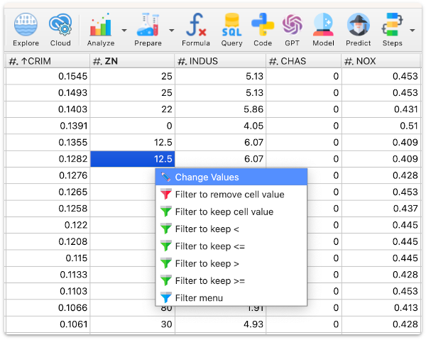
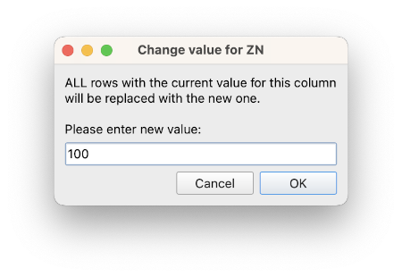
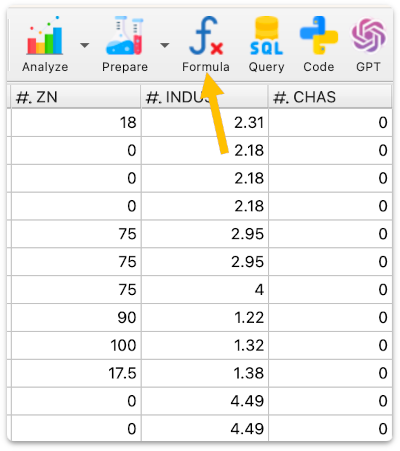
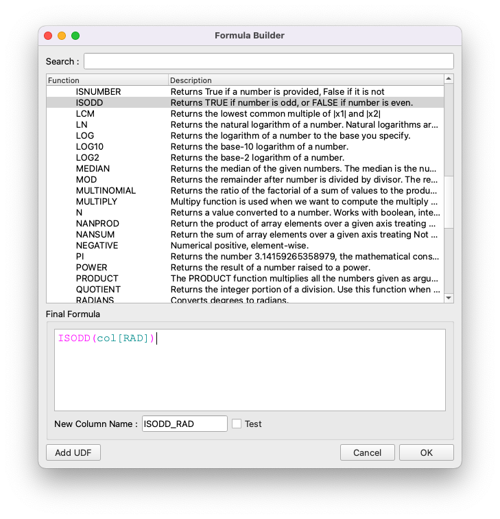
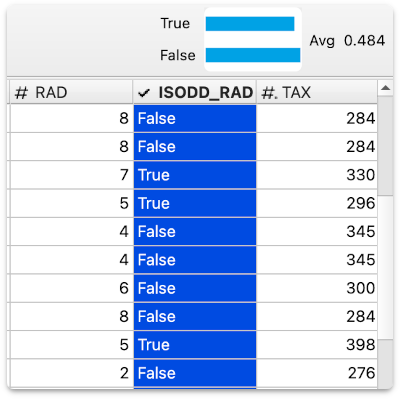
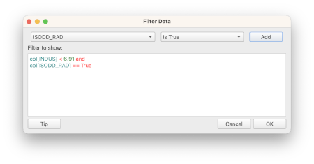
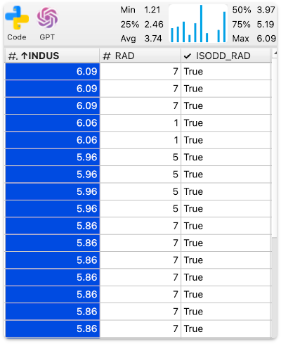
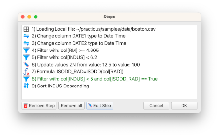

# Introduction to Data Preparation

_This section only requires Practicus AI app and can work offline._

Let's start by loading _boston.csv_. We will ignore the meaning of this dataset since we will only use it to manipulate values.

- Click on _Prepare_ button to view some common data preparation actions

## Sorting Data 

- Click on _CRIM_ column
- Hit Ctrl (Cmd for macOS) + down arrow to sort ascending
- Hit Ctrl (Cmd for macOS) + up arrow to sort descending

You can also open the advanced sort menu by clicking Prepare > Sort

## Filtering Data 

There are several ways to filter data: 

- Click on _RM_ column to view the mini-histogram
- Click on the left most distribution to view filter menu
- Select _Filter to keep >= 4.605_

- Click on a cell value in _INDUS_ column, e.g. 7.87
- Select _Filter to keep <_

This will remove all _INDUS_ values less than 7.87

## Updating Wrong Values

- Click on any cell with 12.5 in _ZN_ column  
- Select _Change Values_
- Enter 123, click on

You will see that **ALL** cells with the value 12.5 in _ZN_ column will be updated to 123

Please note that Practicus AI does not allow you to update the value of an individual cell only. All updates need to be rule-based. The reason for this is to be able to create production data pipelines. E.g. what you _design_ can be used on fresh data every night, automatically. Individual cell updates do not work for this scenario.

## Formulas 

Practicus AI supports 200+ Excel compatible functions to write formulas. If you can use formulas in Excel, you can in Practicus AI.

- Click on the _Formula_ button to open up the formula designer

- Select _ISODD_ function under _Math_ section to find odd numbers  
- You will be asked to choose a column, select _RAD_ column as _Number_  
- Click Add

You can use the designer to build the formula or type by hand. You can also create them in Excel and copy / paste. Unlike Excel, you do not use cell references e.g. A5, D8, but column names directly like the below:

- Leave the column name as suggested: _ISODD_RAD_
- Click ok to run the formula 
- You will see a new column named _ISODD_RAD_ added to the dataset
- Click on _ISODD_RAD_ column to select and hit Ctrl (Cmd in macOS) + left arrow key to move the column to left. Keep doing it until it is next to _RAD_ column

## Advanced filter

- Click on _INDUS_ column name to select and then Prepare > Filter
- Advanced filter designer will open and _INDUS_ column already selected 
- Select _<= Less Than and Equal_ as criteria 
- Click on ... and choose 6.91 select ok 
- Click on _Add_
- Now, select our newly created column _ISODD_RAD_ instead of _INDUS_
- Leave _Is True_ and click _Add_

You will see a filter statement is getting created like the below. You can use brackets and keywords such as (, ), and, or, to build the filter you need.  

After applying your filter you will see the new data set.

- Click on _INDUS_ column
- Hit Ctrl (or Cmd) + up arrow to sort descending
- Hit Ctrl (or Cmd) + right arrow to move the column next to _RAD_

You can view the columns we are working on listed together, like the below 

## Viewing and updating Steps

You can make mistakes while manipulating data, and it is possible to fix these without starting from scratch.

- Click on _Steps_ button

You will view the current steps so far

- Select the filter step
- Hit _Edit step_ button

- Change the filter value from 6.91 to 5
- Click ok

You will see the updated step in green

- Click ok to make the change

You will see that _INDUS_ column is now less than 5

Please note that updating steps will reset the column order, such as moving columns left / right or hiding them.

Instead of opening the _Steps_ dialog you can quickly undo / redo as well:

- Hit Ctrl (or Cmd) + Z to undo a step. 
- Do it a few more times, you will see data is updated automatically 
- Now, hit Ctrl (or Cmd) + Y few times to redo the steps you undid

[< Previous](data-analysis-intro.md) | [Next >](worker-node-intro.md)