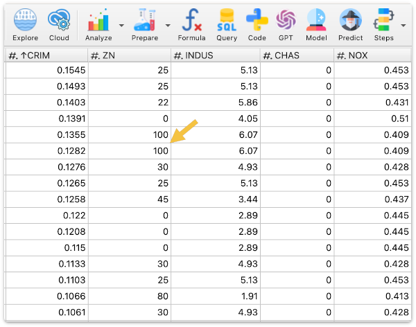
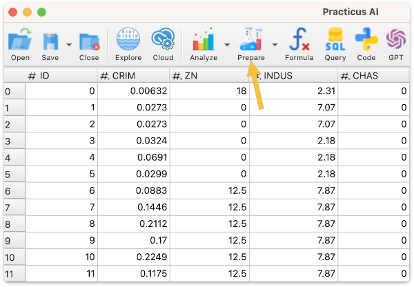
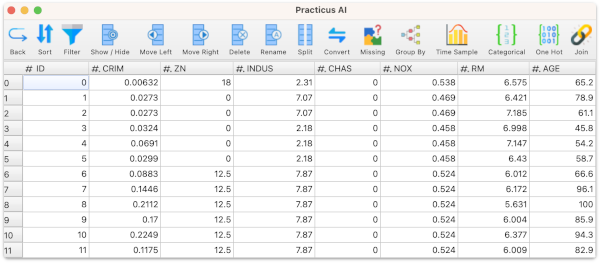
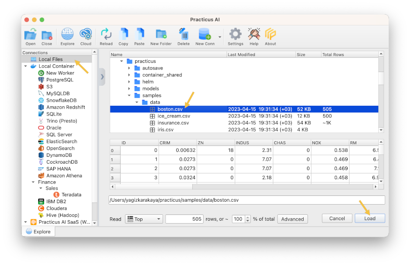
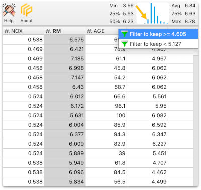
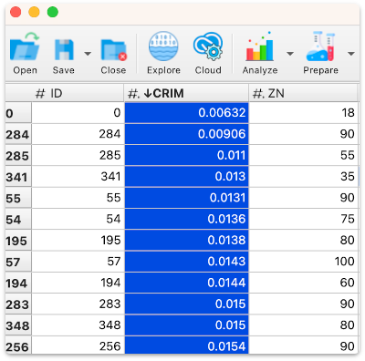
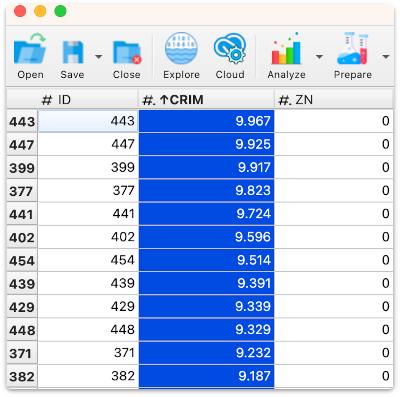
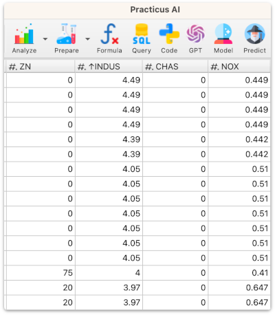

# Introduction to Data Preparation

_This section only requires Practicus AI app and can work offline._

Work in progress. Please check again tomorrow

[< Previous](data-analysis-intro.md) | [Next >](cloud-intro.md)