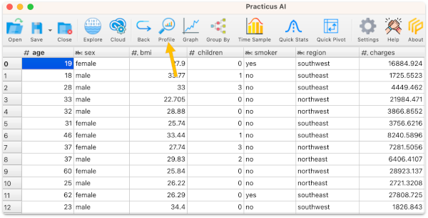
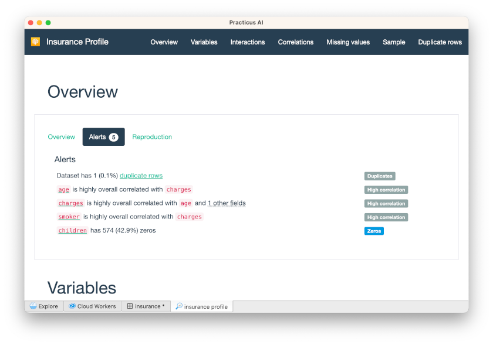
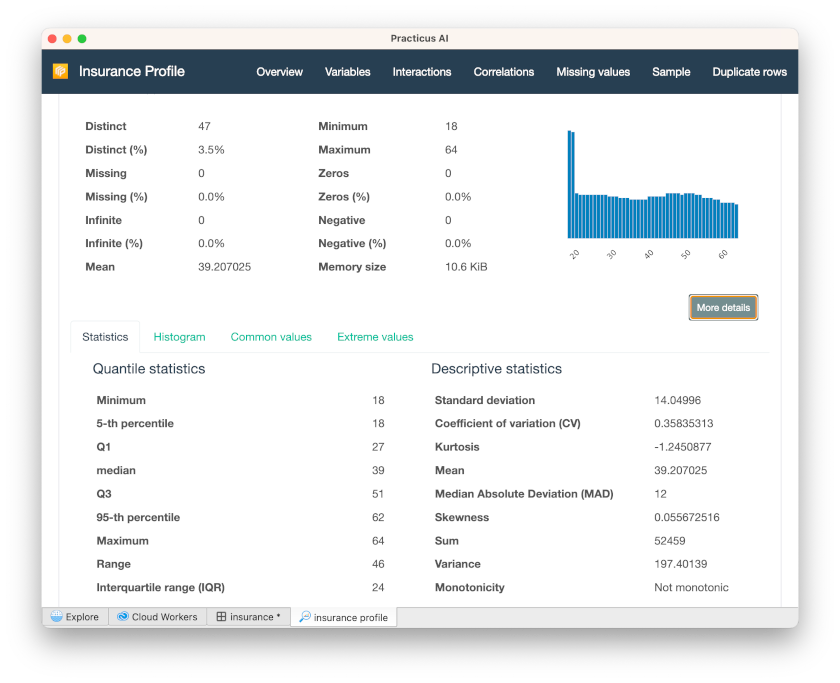

# Data Profiling 

_This section requires a Practicus AI Cloud Worker. Please visit the [introduction to Cloud Workers](worker-node-intro.md) section of this tutorial to learn more._

Profiling your data is an extremely powerful way to get a good understanding of your data distribution and correlations.

- Open _Explore_ tab 
- Make sure a _Cloud Worker_ is selected (upper right)
- Select _Cloud Worker Files_ and open the file below 
- Home > samples > insurance.csv
- Select Analyze > Profile 

After a few minutes, you will see the data profile completed.

- Scroll down to find _charges_, and click its name to expand

You will see several statistical calculations about this data. On the right, you will also see correlations.

For instance, we can see that there is a very high correlation (0.79) between an individual smoking cigarettes and the insurance charges they pay.

- Scroll up and click _Associations_

You will see a matrix view of the correlations and how strong the correlation is. 

Categorical columns (e.g. male / female, smoker yes / no) are shown in squares and numerical columns (e.g. age, bmi) are displayed in circles.
 
In this example, all correlations are positive, so they are displayed with blue. Negative correlations are displayed in red. E.g. If we had a column about how fast someone can run, age column would probably have a negative correlation. I.e. if someone is younger, they would run faster.

## Profiling for difference

You can make changes to your data and then create a profile to compare with the original.

- Go back to the _insurance_ dataset 
- Under _smoker_ column click on a cell that has the _no_ value 
- Select _Filter to keep cell value_
- Select Analyze > Profile again
- You will be asked if you would like to compare with the original data set, select yes

You will now see all the statistics for the original and current data and can compare them side-by-side. 

[< Previous](explore.md) | [Next >](model.md)
