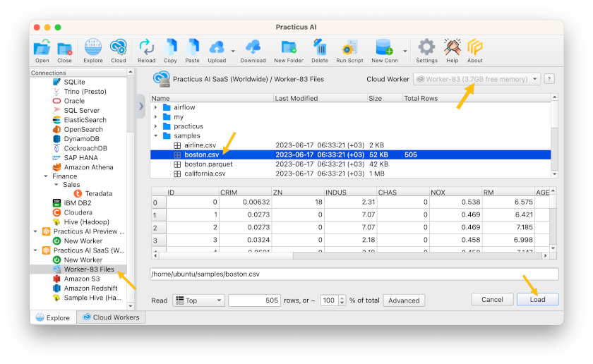
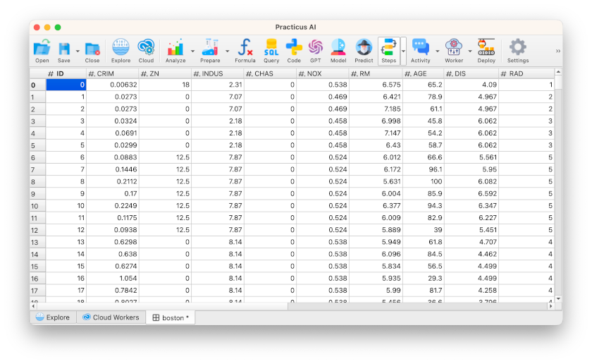
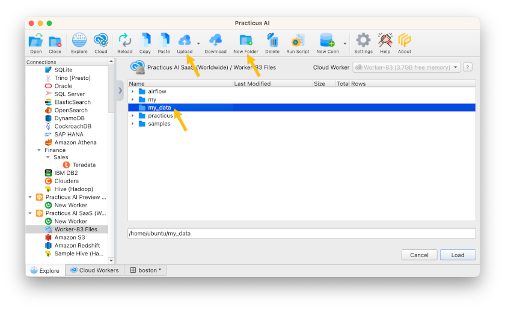
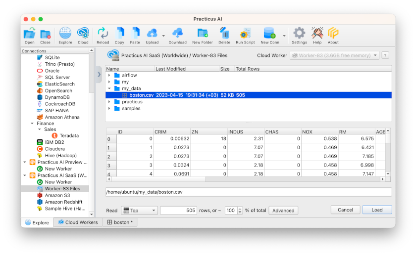
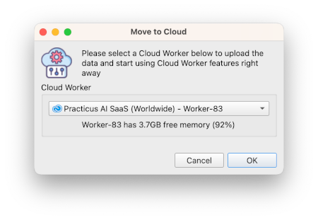

# Exploring Cloud Data Sources

_This section requires a Practicus AI Cloud Worker. Please visit the [introduction to Cloud Workers](worker-node-intro.md) section of this tutorial to learn more._

Once you have a Practicus AI Cloud Worker running and ready, you can access and explore different data sources on the cloud. 

## Cloud Worker Files

Every Cloud Worker has some local storage that you can use to quickly upload/download to use cloud-only features. 

- Click on _Explore_
- Make sure your Cloud Worker is already selected upper left
- Click _Cloud Worker Files_ to load content 
- Expand _samples_ folder and click on _boston.csv_
- Click _Load_ 

Since this data is loaded using a Cloud Worker, a copy of it is already on the Cloud Worker. 

Congrats, now you can use all the Practicus AI features, including advanced AI ones such as AutoML.

For curious minds: When you make changes to your data using the app, you will see the results instantly on the app, and in parallel the changes are applied on the cloud. This avoids wait time.

## Uploading Files

There are multiple ways to quickly upload your data to the cloud, so you can take advantage of cloud-only Practicus AI features or use external services such as Jupyter. 

- Click on _Explore_  
- Select _Cloud Worker Files_
- Click on _New Folder_
- Enter a name, such as _my_data_
- Select your newly created folder, _my_data_ 
- Click on _Upload_ button

- Select one of our local data samples
- Home > practicus > samples > data > boston.csv
- A file Transfer tab will open, click _Start Transfer_
- Close after done 
- Go back to _Explore_ tab, click _Reload_ 

You will see that your data is now uploaded to the local disk of the Cloud Worker

Tips:

- You can upload / download entire directories 
- Your data is compressed during upload / download, saving on bandwidth and time
- You can also use Copy / Paste between data sources to quickly move data around

## Quick Upload

Sometimes you will not know in advance if you are going to use a cloud-only feature or not, and start working offline. 

Practicus AI offers a quick way for you to start offline and continue in the cloud later:

- Open _Explore_ tab
- Click on _Local Files_ and load the below file 
- Home > practicus > samples > data > boston.csv 
- Select _CRIM_ column, hit delete or backspace to delete the column
- Click on _Model_ button (AutoML) 

You will see a note telling this is a cloud-only feature and asks if you would like to upload your data to the cloud.

- Select Yes

- Select a Cloud Worker, such as the one you created in the previous section
- Click Ok

Your data will be uploaded **AND** all your steps (such as deleting _CRIM_ column) will be applied. 

- Click _Model_ button again to verify it now works
- Click cancel, we will visit AutoML later

## Working with S3

S3 is a very common location for Big Data and AI/ML workloads. Your AWS account might already have access to some S3 buckets (locations)  

- Open _Explore_ tab
- Click on _S3_
- Select _Load Buckets_ under _Bucket_
- In as moment, you will see all the S3 buckets you have access to under _Bucket_

Notes: 

- If you need to use a bucket under another AWS account, you can select _I will enter my credentials_ under _Cloud Config_ to manually enter security credentials
- If you would like to learn how to create a bucket please visit the [AWS guide](https://docs.aws.amazon.com/AmazonS3/latest/userguide/create-bucket-overview.html)
- If you would like to experiment using public S3 buckets, please check this [registry](https://registry.opendata.aws/)

[< Previous](worker-node-intro.md) | [Next >](data-profiling.md)