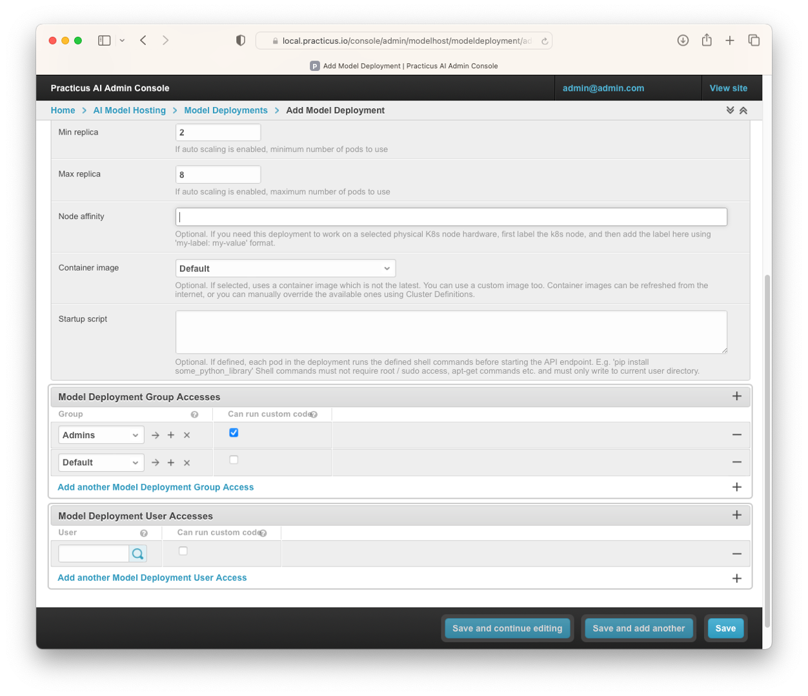

# Introduction to MLOps

_This section requires a Practicus AI Cloud Worker, Object Storage, and Kubernetes Cluster. Please visit the [introduction to Cloud Workers](worker-node-intro.md) section of this tutorial to learn more._

### What is MLOps

- MLOps is a set of practices that automates the machine learning lifecycle from development to deployment to monitoring and maintenance. It bridges the gap between ML engineers and DevOps teams to create a culture of continuous improvement for ML products.

### Why is MLOps Important?
- MLOps is a valuable tool for organizations that want to get more value from their ML investments. By automating and managing the ML lifecycle, MLOps can help organizations to deploy ML models to production faster, improve the quality and reliability of ML models, reduce the risk of ML failures, and increase the ROI of ML investments.

### What is Practicus AI's MLOps approach?

Practicus AI MLOps Approach is a way to deploy and manage AI models more easily and effectively. It does this by providing a unified user experience, open-source Cloud Native technology, different deployment methods, dynamic service mesh, fine-grained access control, global APIs, and the ability to modernize legacy systems.

1. Unified user experience and federated governance: Practicus AI provides a single interface for managing and consuming AI models, even if they are deployed in multiple locations using different cloud providers and data sources. This makes it easy for business users and developers to interact with your AI models, regardless of their technical expertise.
2. Open-source Cloud Native technology: Practicus AI is built using open-source Cloud Native technology, so you can avoid vendor lock-in.
3. Different deployment methods: Practicus AI offers a variety of deployment methods, so you can choose the one that best suits your needs. AutoML makes it easy to build and deploy models without writing any code. Jupyter Notebook allows you to experiment with models and deploy them to production with just a few clicks. And custom code gives you complete control over the deployment process.
4. Dynamic service mesh: Practicus AI uses Kubernetes deployments to create a dynamic service mesh for your AI models. This makes it easy to scale your models up or down as needed, and to manage multiple model versions simultaneously.
5. Fine-grained access control: Practicus AI provides fine-grained access control tokens that allow you to control who can deploy, consume, and manage your AI models. This helps you to protect your models from unauthorized access.
6. Global APIs: Practicus AI allows you to enable global APIs that allow developers to use a single URL to automatically use the closest cloud. This makes it easy to deploy and consume your AI models globally, with high availability and performance.
7. Modernize legacy systems: Practicus AI can be used to modernize legacy or proprietary AI systems by wrapping them with Practicus AI MLOps. This allows you to get the benefits of Practicus AI MLOps without having to make changes to your existing code.

## Deploying AI Models 

In this section we will learn how to deploy the models we created in Practicus AI.

- Firstly, open Practicus AI App.
- Click Start Exploring and see this screen.

- In this step, tap on the dataset to load the dataset to build the model.
- Preview your dataset and make optional advanced adjustments, and Load dataset.
- Click on the model and choose the type of model according to your problem.(E.g. Classification, Clustering, Anomaly Detection...)
- Select Objective Columns and adjust Advanced settings.

- Click OK.
- Wait for model setup and see the model dialog.

- When you see the Model dialog, select Deploy Model (API)

- Select the appropriate one from the Prefixes you created in the Admin Console. (We will examine creating them in the admin console tab)
- Click Select model prefix or model. (Hint: If you register your model on an existing model, it will register as version 2)
- See your model and specifications under this prefix.

- Back to Dataset.
- Click predict and select the model you deploy.
- Click OK.
- You can see the new Predict columns created.

Now that we have learned how to deploy the model we created, let's learn how to manage these operations from the Practicus AI Admin Console.

## Practicus AI Admin Console for AI Model Hosting Administration

- Open Practicus AI Admin Console.

### Model Deployments

- Open Practicus AI Admin Console and click AI Model Hosting.

- Click Model Deployments. (Hint: The reason why it is called Model Deployment is that the models you host are created as Deployment in Kubernetes. This has several advantages, and you can do all operations from the Admin Console without updating the YAML file.)

- In the area where you open Model Deployments, you can make configurations related to the model, set the resource to assign to the models and assign auto scaler.

- At the same time, there may be containers that you have prepared with extra packages in this area, you can assign them, and you can add extra libraries to these containers with pip install by writing a startup script.
 

- You can assign these Deployments on a group and user basis so that you can easily manage the models. You can also authorize these users and groups to run custom code.

- After completing and saving the necessary operations, you can open Deployments from Kubernetes Dashboard and see the Deployment you created.

### Model Prefixes

- Click Model Prefixes.

Prefixes also represent URLs. You can set OpenAPI documentation settings in this area.
You can also upload your pre-built models to Practicus AI and manage production settings and super secrets from there.

- You can set access authorizations on group and user basis to the prefixes you create from this area. You can also set who can run custom code in this prefix.
- You can also assign a token to this prefix and access the models with this token.

### Models

- The models you create may not work as they used to over time. You can create new models and save these models as new versions and assign these versions as **staging** and **production**.
- At the same time, you can easily switch between the models you have created and saved as staging and/or production.
- With Practicus AI's **dynamic service mesh** approach, you can easily route traffic between models. Let's take a look at how this works.

- Click Models.
- Select Owner.
- Select Model Prefix.
- Select Name for model.

- Perform Deployment assignment of models.
- You can mark Stage as **Staging** and/or **Production**.
- Perform traffic routing between these versions with **Traffic Volume Weight%**. 
- If you select Cascade prefix access tokens, you can access this model with the access token you defined for the prefix.

### Model Versions

- Select Model Versions.
- Click Add Model Version.
- Choose your existing model.
- Enter Model Version.
- Assign Model Deployment.
- Set Stage status .
- Assign Traffic Volume Weight%.
- You can choose the model as a draft if you want. If you choose, this model will not be marked as latest.
- Click Save.

### External API Access Tokens

- Click External API Access Tokens.
- Select Add External API Access Token.
- Select Owner.
- Set Expiry date. (Hint: For advanced use cases. Python style dictionary to add extra key value pairs to the JWT token.)
- Select Global id. (Hint: For advanced use cases.  To build highly available and accessible APIs distributed in different geos, you can define tokens with the same global id and use them across the globe. E.g. a mobile app can access a global API 'api.company.com', and the DNS can  route the traffic to 'us.api.company.com' or 'eu.api.company.com' depending on user location OR service availability.)
- Select Model Prefix External API Access Tokens or Add another Model Prefix External API Access Token.
- Select Model External API Access Tokens or Add another Model External API Access Token.
- Click Save.

We have completed the MLOps operations that can be done from the Practicus AI Admin Console. 

Now you can access our MLOps video from the link below to try these operations and digest the information you have gained:

[Practicus AI Open MLOps](https://www.youtube.com/watch?v=S9cUE1Bh7RE&t=6s)

### Optional: Model Documentation 

- Business users can easily explore individual systems with the interface and access data sources. Technical users can easily access the documentation of the models with Swagger, OpeAPI or Redoc.

[< Previous](develop_ml_models.md) | [Next >](end-advanced.md)