# Modeling with AutoML

_This section requires a Practicus AI Cloud Worker. Please visit the [introduction to Cloud Workers](worker-node-intro.md) section of this tutorial to learn more._

- You can use Practicus AI for both supervised and unsupervised learning.
- Hint: In supervised learning, your dataset is labeled, and you know what you want to predict. 
In unsupervised learning, your dataset is unlabeled, and you don't know what to do. But with Practicus AI, you can switch from unsupervised to supervised learning.

## Loading Insurance dataset

- Open _Explore_ tab
- Select a _Cloud Worker_ upper right of screen (start new or reuse existing)
- Select _Cloud Worker Files_ 
- Navigate to Home > samples > insurance.csv and _Load_ 
- Click _Model_ button

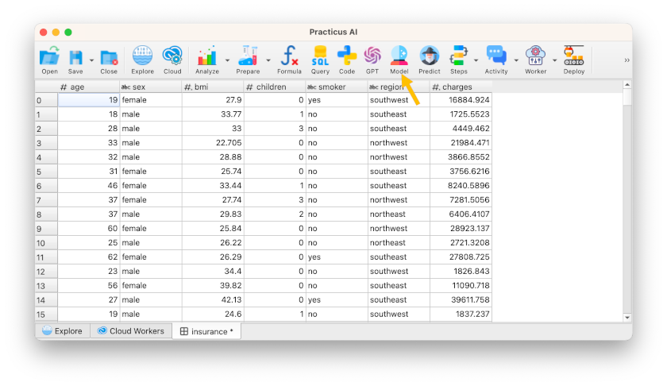

- View the below optional sections, and then click ok to build the model

## (Optional) Building Excel Model

By default, models you build can be consumed using Practicus AI app or any other AI system. If you would like to build an Excel model, please do the following. Please note that this feature is not available for the free cloud tier.

- In the _Model_ dialog click on _Advanced Options_
- Select _Build Excel model_ and enter for how many rows, such as 1500

## (Optional) Explaining Models

If you would like to build graphics that explain how your model works, please do the following. Please note that the free tier cloud capacity can take a long time to build these visualizations.  

- In the _Model_ dialog click on _Advanced Options_
- Select _Explain_

- Click ok to start building the model

- Hint: The _Select Top % features by importance_ setting only includes the most important variables in the model. If two variables are highly correlated, then the model can already predict the target variable with one variable, so the other variable is not included.

If you choose the optional sections, model dialog should look like the below:

You should see a progress bar at the bottom building the model. 

For a fresh Cloud Worker with regular size (2 CPUs) the first time you build this model it should take 5-10 minutes to be completed. Subsequent model runs will take less time. Larger Cloud Workers with more capacity build models faster and more accurately.  

After the model build is completed you will see a dialog like the below.

- Select all the options
- Click ok

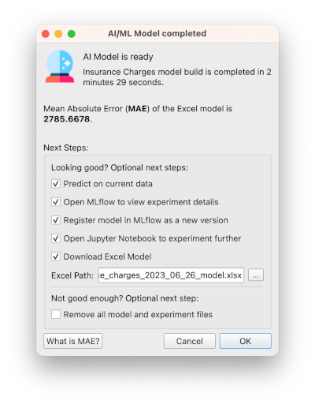

If you select Predict on current data option in the dialog above, you can see the prediction results in the data set after the model is built.

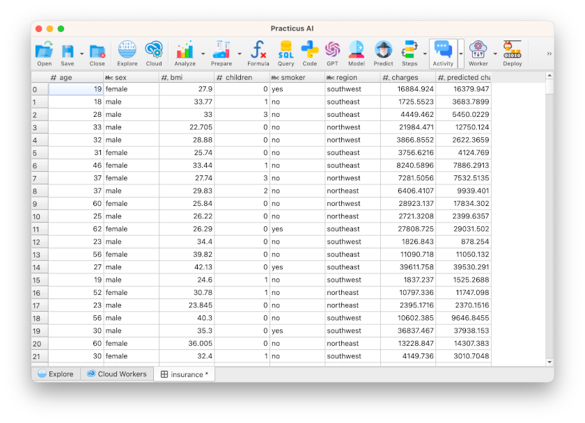

If you requested to build an Excel model, you will be asked if you want to download. 

We will make predictions in the next section using these models, or models that other built. 

## (Optional) Reviewing Model Experiment Details

If you chose to explain how the model works: 

- Click on the _MLflow_ tab
- Select _explain_ folder at the left menu 
- Navigate to relevant graphics, for instance _Feature Importance_

The above tells us that an individual not being a smoker (smoker = 0), their bmi, and age are the most defining features to predict the insurance charge they will pay.

Note: You can always come back to this screen later by opening _Cloud Workers_ tab, clicking on MLflow button and finding the experiment you are interested with. 

## (Optional) Downloading model experiment files

You can always download model related files, including Excel models, Python binary models, Jupyter notebooks, model build detailed logs, and other artifacts by going back to Explore tab and visiting Home > models

You can then select the model experiment you are interested, and click download  

## (Optional) Saving Models to a central database 

In the above steps, the model we built are stored on a Cloud Worker and will disappear if we delete the Cloud Worker without downloading the model first. This is usually ok for an ad-hoc experimentation. A better alternative can be to configure a central MLflow database, so your models are visible to others, and vice versa, you will be easily find theirs. We will visit this topic later.    

## Modelling with Time Series
- Open _Explore_ tab
- Select a _Cloud Worker_ upper right of screen (start new or reuse existing)
- Select _Cloud Worker Files_ 
- Navigate to Home > samples > airline.csv and _Load_ 
- Click _Model_ button
- In the _Model_ dialog click on _Advanced Options_
- Select _Explain_
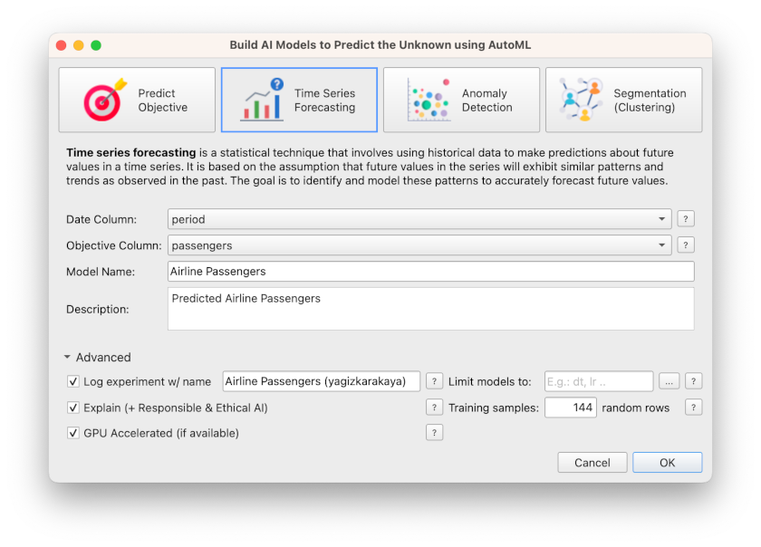

After the model build is completed you will see a dialog like the below.

- Select Predict on Current data and entry _Forecast Horizon_. It sets how many periods ahead you want to forecast in the forecast horizon.
- Click ok
  
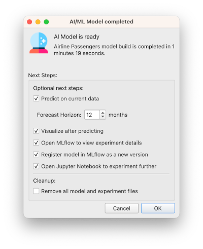

Select Visualize after predicting and see below graph.

- The orange color in the graph is the _12-month forecast_ result.

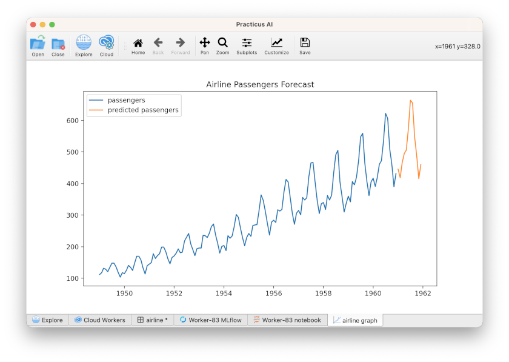

- If you select Predict on current data option in the dialog above, you can see the prediction results in the data set after the model is built.

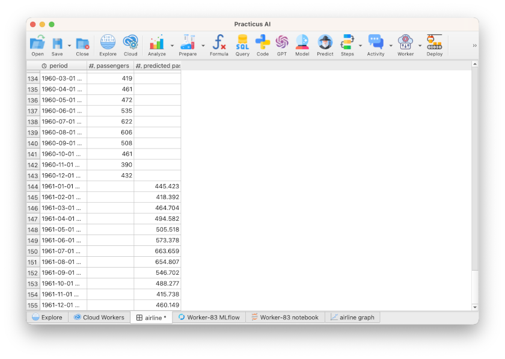

## Modelling with Anomaly Detection

- Open _Explore_ tab
- Select a _Cloud Worker_ upper right of screen (start new or reuse existing)
- Select _Cloud Worker Files_ 
- Navigate to Home > samples > unusual.csv and _Load_ 
- Click _Model_ button
- In the _Model_ dialog click on _Advanced Options_
- Select all the options
- Click ok

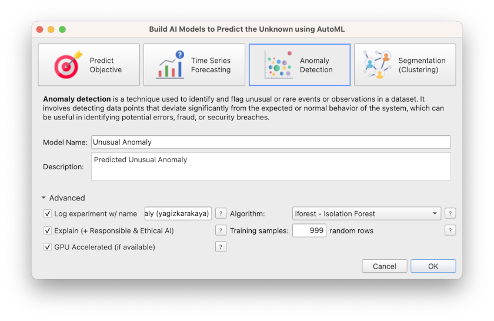

After the model build is completed you will see a dialog like the below.

- Select all the options

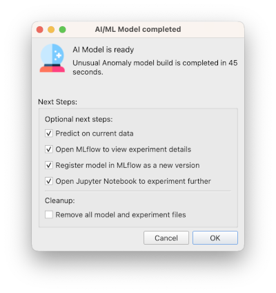

- If you select Predict on current data option in the dialog above, you can see the prediction results in the data set after the model is built.

- Click on the _MLflow_ tab
- Select _explain_ folder at the left menu 
- Click _t-SNE(3d) Dimension Plot_

You can hover over this 3D visualization and analyze the anomaly results.

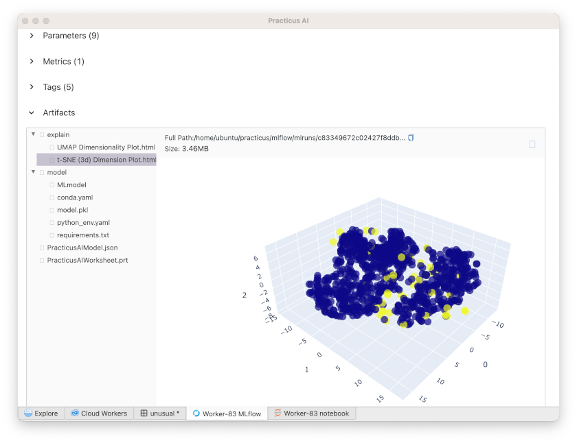

## Modelling with Segmentation(Clustering)

- Open _Explore_ tab
- Select a _Cloud Worker_ upper right of screen (start new or reuse existing)
- Select _Cloud Worker Files_ 
- Navigate to Home > samples > customer.csv and _Load_ 
- Click _Model_ button
- In the _Model_ dialog click on _Advanced Options_
- Select all the options
- Click ok

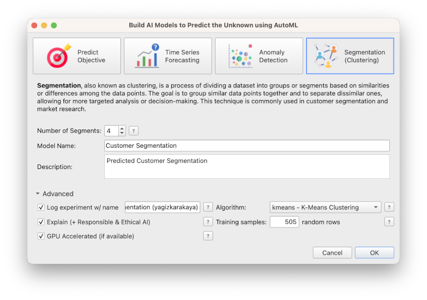

- Click on the _MLflow_ tab
- Select _explain_ folder at the left menu 
- Click _Elbow Plot_
- See the optimal number of clusters
- Hint: The elbow method is a heuristic used to determine the optimum number of clusters in a dataset. 

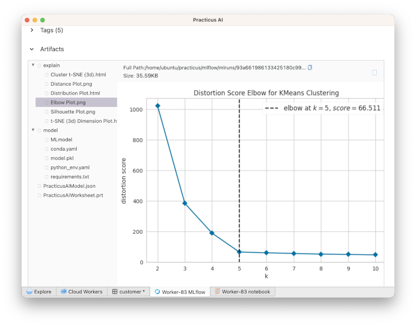

- Click _Distribution Plot_
- You can hover over this _Bar chart_

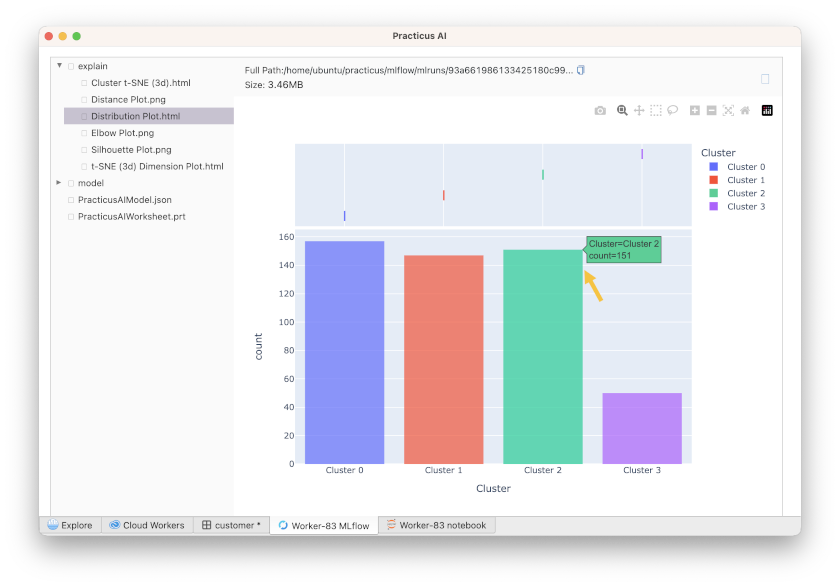

[< Previous](data-profiling.md) | [Next >](predict.md)