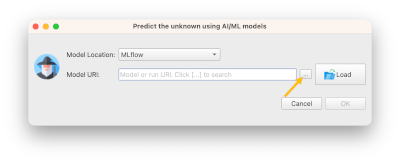
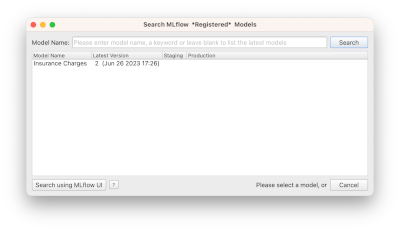

# Making Predictions

_This section requires a Practicus AI cloud node. Please visit the [introduction to cloud nodes](cloud-intro.md) section of this tutorial to learn more._

## Loading Insurance dataset

- Open _Explore_ tab
- Select a _Cloud Node_ upper right of screen (start new or reuse existing)
- Select _Cloud Node Files_ 
- Navigate to Home > samples > insurance.csv and _Load_ 
- Click _Predict_ button


## AI Model locations 

The AI model you or some other person built can be found on a variety of locations or databases. 

Practicus AI currently support predicting models in the below locations:

- MLflow model database
- Your computer
- S3
- An API endpoint (for programmers)

In this tutorial we will show MLflow usage. 

## Predicting using MLflow database

- To locate the model we just built click on the ... to search for it



- In the search dialog that opens, type _insurance_ and hit enter

- You will find the AI model you built in the previous section of this tutorial.

Cannot find model? It is probably because you are not using a central MLflow database yet, and you built the AI model using a different cloud node. Please check the [using a central MLflow database](#optional-using-a-central-mlflow-database) section below to learn more. For now, please read insurance.csv using the same cloud node that you built the AI model with.  



- Select the model and click ok

You will see the model location (URI) on screen. Although you can click ok to make the  predictions now, we strongly suggest you load the model details (metadata) first. 

- Click _Load_ to load model details


- If you prefer, make the dialog larger
- Rename _predicted column name_ to _charges predicted_ since we already have a column named _charges_. If you don't, predicted values will overwrite the original ones.
- Confirm the features (columns) requested by the model match the ones that we provide

Note: Sometimes the feature names will not match. E.g. AI model could need a feature named _children_, and our dataset could have a feature named _child_. Practicus AI uses a simple AI algorithm to match the features names, but it is possible there is a mistake. It is always a good practice to confirm the matching is correct. 

- Click ok to predict 


Your predictions will be made.


## Analyzing model error

Your AI model will almost always have a margin of error. We can _estimate_ the error we _expect_ this model will make. 

- Click on _Formula_ button 
- Add the below formula, and name the new column _Model Error_

```
ABS(col[charges] - col[charges predicted])
```
We used ABS() function to calculate absolute value E.g. |-1| = 1 so error is always a positive value. 

- Click ok 


You will see the errors our model makes. 

- Click on _Model Error_ column
- Move your mouse over the mini-histogram

You will see that in ~75% of the cases, we _expect_ that our model will make an error less than ~$2200


- Move your mouse to the right on the mini-histogram to see in what % of the cases our model makes not so good predictions
- Click on one of the _bad_ prediction bars on the mini-histogram, and select _Filter to Keep >= ..._


You will see all the cases where our model did not do a good job.

- Select _Model Errors_ column 
- Hit Ctrl (or Cmd) + Up Arrow to sort descending

You will now see the worst predictions located at the top. When you select a column, bottom right hand of the screen shows some basic statistics in addition to the mini-histogram. You will see that in 127 cases our model had some room for improvement.


This might be a good time to analyze the individuals of the _not so good_ predictions, and see if there is anything we can do to get our data in a better shape. Often, better data will lead to better models.

You can use the same analytics tasks to visualize and profile this data to see if there is a _pattern_ you can detect. In some cases, your data will have errors, and fixing these will improve the model. In some other cases, you will find out that you are simply _missing key features_. E.g. for the insurance example, existing health problems could very well be a key indicator for the charges, and we miss this data. 

Sadly, there is no standard way to improve AI models. Sometimes a technical machine learning coder can greatly improve a model by _tweaking_ parameters. And in some other cases a domain experts' professional experience to _optimize_ the data will be the answer. For some tough problems, you will most likely need both of these personas do their _magic_, and collaborate effectively. 

## (Optional) Understanding Ground Truth

In most real life scenarios, you will make predictions for unknown situations based on what we already know, the ground truth. 

Then, "life will happen", and you will observe the real outcome. 

For instance, you can make predictions on which customer you "might" lose. This is called _customer churn prediction_ AI use case. 6 months later, you will see that (unfortunately) you really lost some customers. And you will have more up-to-date ground truth. 

With Practicus AI, you can make regular predictions, for instance weekly or nightly, by deploying your models to _production_. We will discuss how to do this later. 

Practicus AI allows you to store your predictions in a database, so you can compare them later with the ground truth life brings, This will give you the **real errors** your models make, in comparison to the **estimated errors** we discussed in the previous section.   

## (Optional) Understanding Model Drift

If you choose to store your prediction results regularly, and then compare these to the ground truth, AND you do this on a regular basis you will have a good feeling of how your models perform. In some cases, a model that was doing great a while back will start to perform not so good. This is called the model drift.

With Practicus AI, you can implement systems to automatically detect which of models start drifting. We will discuss this topic later. 

## (Optional) Using a central MLflow Database

In this tutorial we used a local MLflow database on a cloud node, which will disappear when you terminate it. This will be perfectly fine if you are just experimenting. For other cases, you can copy your models from the cloud node manually. Or even better, you can store them in a central database at first place. 

To store models in a central database and share with others, do the following: 
- Create or reuse a cloud database, such as MySQL or Postgresql 
- Create an S3 bucket to store model artifacts. These are binary files, which can be very large, so it is not a good idea to store them in a relational database 
- Open Practicus AI app, go to settings > MLflow
- Enter the connection string of the database
- Enter S3 bucket

Sample MLflow setup 


When you have a central MLflow database configured, your cloud nodes will automatically switch to using this database, instead of the local ones. 

With a central model database you can:

- Consume other users models to make predictions
- View other users experiment results 
- View model explanation visuals 
- Predict using models that are **not** built with Practicus AI 
- Share Practicus AI models with other systems, so they can make predictions **without** Practicus AI 

Central model databases can greatly democratize how AI models are built, and how they are consumed. 


[< Previous](model.md) | [Next >](sql.md)