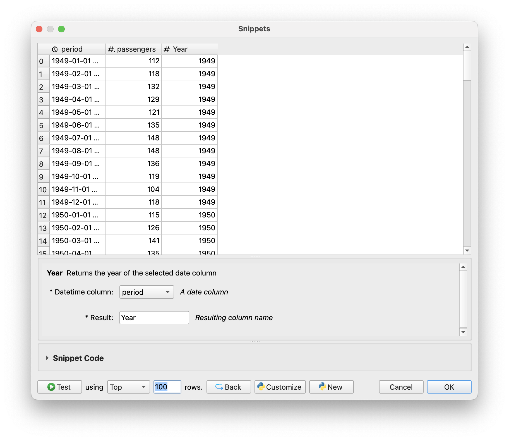
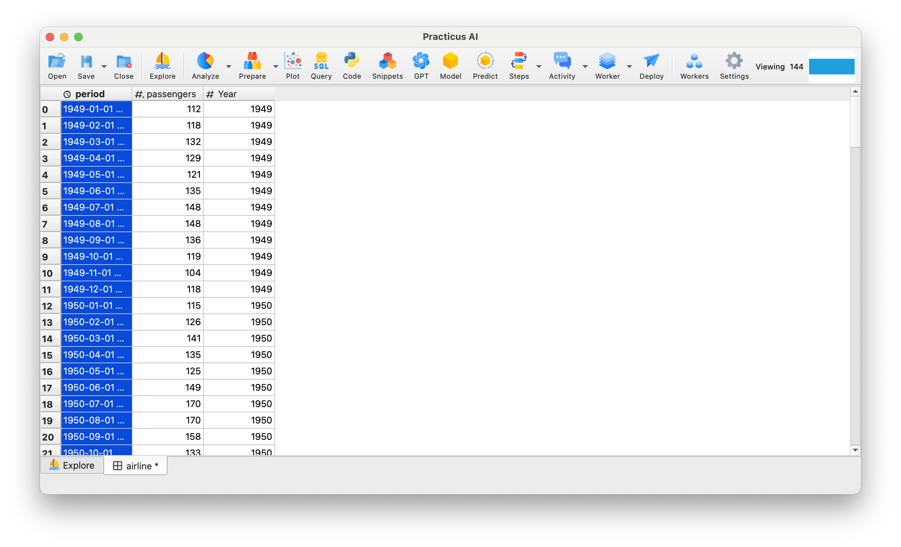
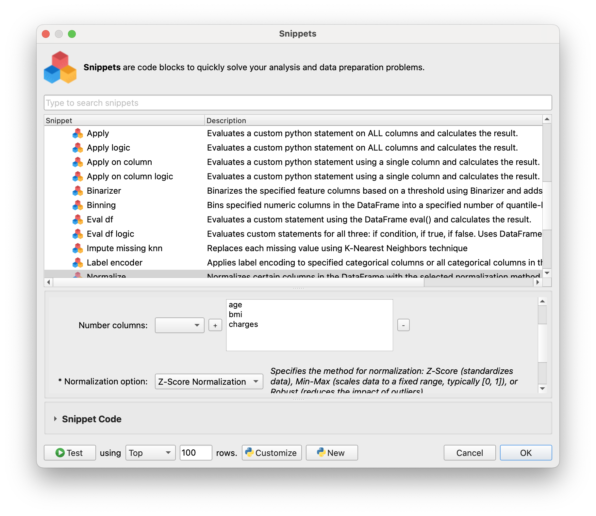
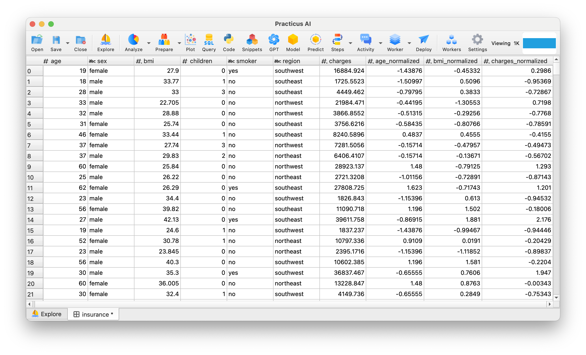
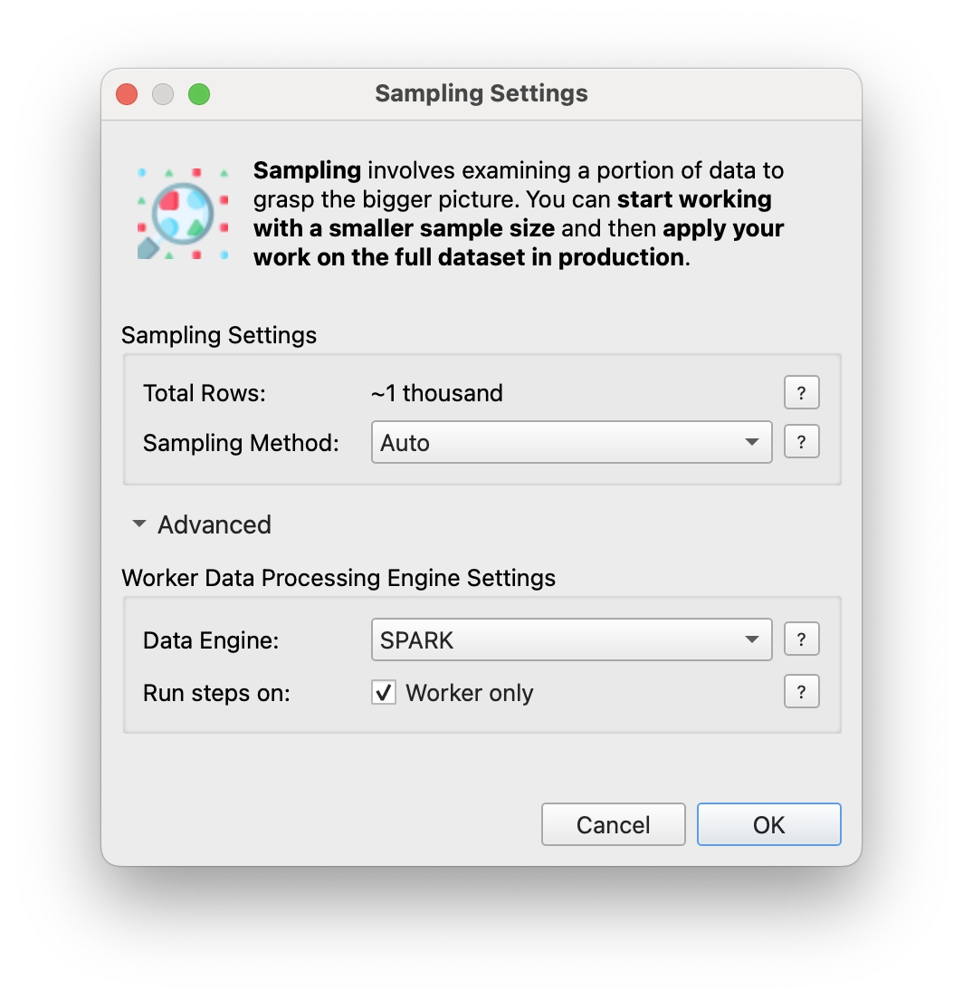
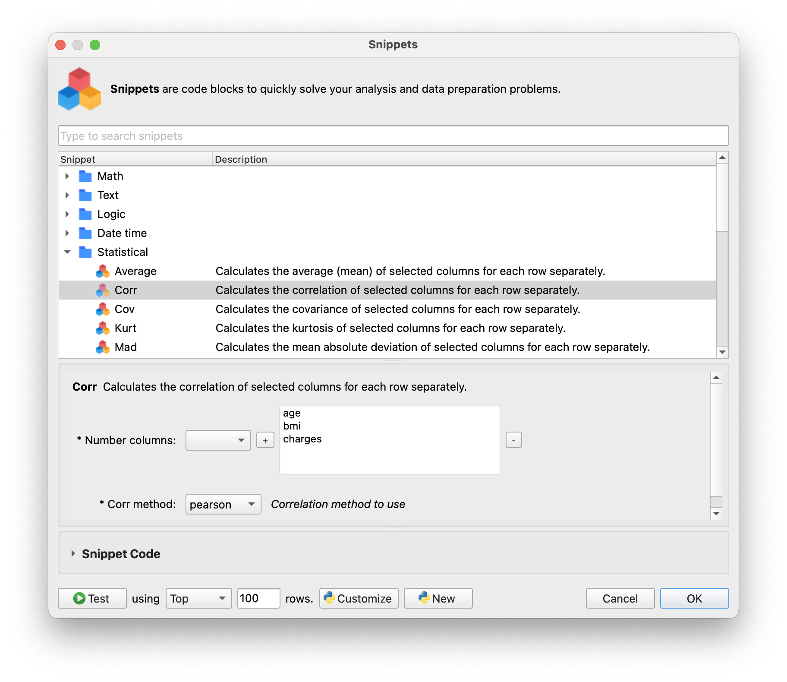
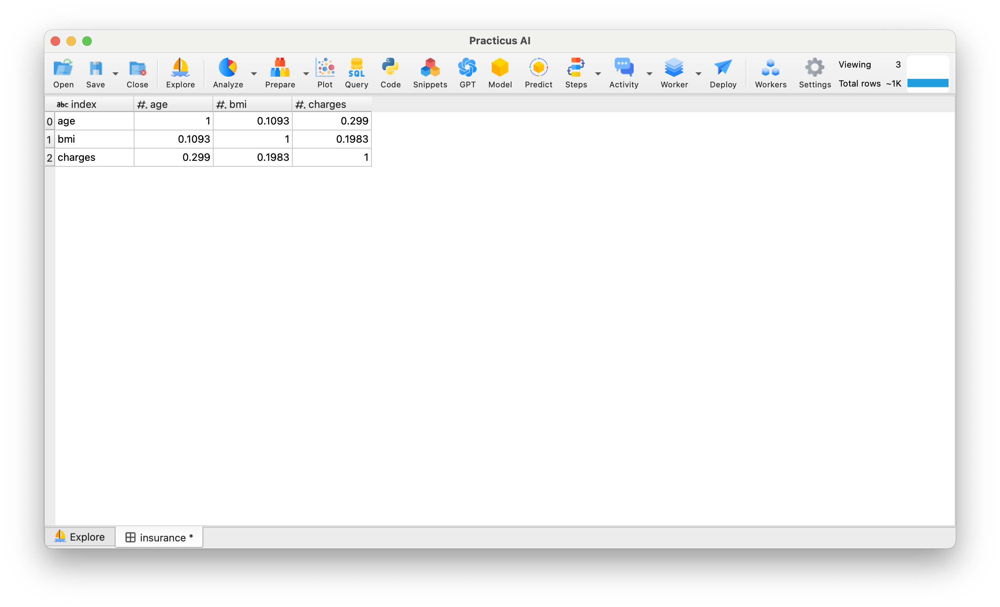

# Snippets

### What is Snippets?

Snippets are blocks of code written in Python, prepared for technical and non-technical users. These snippets are designed to perform specific and frequently encountered programming tasks so that users can manage their data processing faster and more efficiently. Snippets are especially ideal for tasks such as data manipulation because these code blocks eliminate the need for users to rewrite code every time.

### Functionality and Benefits of Snippets

- Snippets provides standardized and optimized code solutions, allowing users to quickly apply frequently needed operations on data sets with a few clicks. This saves time and minimizes coding errors.

### Advantages of Using Snippets

- Time Efficiency: Saves time by reducing the need to write code for repetitive tasks.

- Accessibility: Snippets are open source. Users can share the snippets they create with their teammates or all Practicus AI users.

- Standardization: Data processing operations are applied in a consistent and repeatable way for each user, ensuring continuity across projects.

### Using Existing Snippets

- _Hint:_ By default, snippets are located in users' hidden .practicus folder. In this tutorial you will see more than one snippet folder. This is because I have also put the snippets in the other Practicus folder. The advantage is that you can create and test new snippets there and easily customize existing snippets. 

- Open _Explore_ tab 
- Make sure a _Cloud Worker_ is selected (upper right)
- Select _Worker Files_ and open the file below 
- Samples > airline.csv
- Click _Prepare_
- Select period column and click convert then choose _Date Time_
- Click OK
- Then select Snippets
- Open the _Date time_ folder and choose _Year_
- Then choose _Datetime column_ as _period_
- Then set the result name to _Year_ and click on the test, then see the preview.

- Then Click OK and see the new variable created

### Using Advanced Snippets

- Open _Explore_ tab 
- Make sure a _Cloud Worker_ is selected (upper right)
- Select _Worker Files_ and open the file below 
- Samples > insurance.csv
- Select Snippets
- Open the _Advanced_ folder and select _Normalize_
- Then choose _Number columns_ as _age, bmi, and charges_
- Then set _Normalize_ option as _Z-Score Normalization_

- Then Click OK and see the new variable created with *columnname + _normalized*

# Advanced Section for Technical Users

### Snippets for SPARK Engine

- Open _Explore_ tab 
- Make sure a _Cloud Worker_ is selected (upper right)
- Select _Worker Files_ and open the file below 
- Samples > insurance.csv
- Click customize sampling at the bottom left 
- Click Advanced and set _Data Engine_ as _SPARK_ 

- Then click OK and Load
- Select Snippets
- Open the _Statistical_ folder and select _Corr_
- Then choose _Number columns_ as _age, bmi, and charges_
- Then set _Corr method_ option as _Pearson_ (other options kendall and spearman)

- Then Click OK and see that the correlation table is formed 

- *Hint:* Not all snippets work on SPARK Engine. To see which engines the snippets work in, you can look at the Snippets Code at the bottom of the screen when you select a snippet.

### Creating New Snippets

- Open _Explore_ tab 
- Make sure a _Cloud Worker_ is selected (upper right)
- Select _Worker Files_ and open the file below 
- Open any csv file
- Select Snippets and click _New_ at the bottom
- Then, you will see a template for generating snippets, and in this template you will have access to a detailed explanation of how to create snippets.

