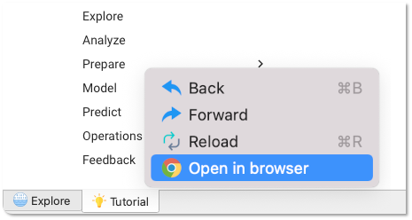

# Practicus AI tutorial 

Welcome to Practicus AI hands-on tutorial. 

## Topics covered in this tutorial

This tutorial will help you get started with the below topics using Practicus AI

- **Explore** and **Analyze** **Big Data**
- Build AI models using **AutoML** 
- Make **predictions** using AI models 
- **Data preparation** to manipulate data interactively 

## How can this tutorial help you?

#### Non-technical Users 

You will learn to be self-sufficient for most AI and Big Data tasks. If things get complicated, you will also learn to effectively collaborate with technical-users.

#### Semi-technical Users 

Can you write SQL or Excel formulas? In addition to the above, you will also learn to extend the functionality quite a bit.

#### Data Scientists

If you are ok to click for some tasks, this tutorial will teach you to accelerate plenty, especially for data prep.  If you are a die-hard coder, you can use Practicus AI to get support from others, _especially domain experts_, for data discovery, preparation, quality, and model consumption. 

#### Data / ML Engineers

You can use Practicus AI as a modern and interactive ETL tool. You will also get _clean production ready code_ for all the tasks (Data + AutoML + Predictions) that _others_ perform, technical or not.

## Big Picture Summary

The below is a summary of what this tutorial will cover and for whom. Please check our [documentation](../index.md) for other topics. 

### Before we begin

If you are viewing this tutorial inside the Practicus AI app, you can **right-click the tutorial tab and open it inside your browser as well**. This can be useful if you would like to view the tutorial side-by-side with the app.  

Let's get started! 

[Next >](data-analysis-intro.md)