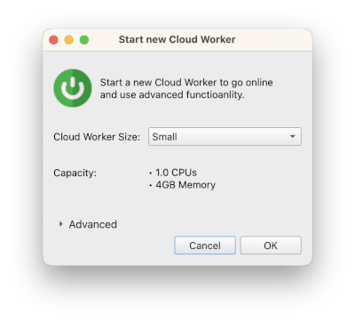

# Introduction to Practicus AI Cloud Workers

Some advanced Practicus AI features require to use software in addition to Practicus AI APP or the developer SDK. In this section we will learn how to use Practicus AI Cloud Workers.

## What is a Cloud Worker?

Some Practicus AI features such as **AutoML**, making ** AI Predictions**, **Advanced Profiling** and **production deployment** capabilities require a larger setup, so we moved these from the app to a backend (server) system.  

You have multiple Cloud Worker options to choose from. You can run them in the cloud or on your computer. Please view [help on choosing a Cloud Worker](../setup-guide.md#choose-a-worker-node-system) to learn more.  

## Setup Cloud Worker

Please check the [Setup Guide](../setup-guide.md) to learn how to configure Practicus AI Cloud Workers. 

You can use the free cloud tier for this tutorial, or use containers on your computer as well.

## Launching a new Cloud Worker

- Click on the _Cloud_ button to open the _Cloud Workers_ tab
- Make sure the selected local for your computer, or the optimal _AWS Cloud Region_. The closest region geographically will usually give you the best internet network performance
- Click _Launch New_ 

- Pick the type (size) of your Cloud Worker
- Click ok to launch 

The default size will be enough for most tasks. You can also choose the free cloud tier.

In a few seconds you will see your Cloud Worker is launching, and in 1-2 minutes you will get a message saying your Cloud Worker is ready.

## Stopping a Cloud Worker

If you use local container Cloud Workers you have less to worry about stopping them.  

### Cloud Cloud Workers
Similar to electricity, water, or other utilities, your cloud vendor (AWS) will charge you a fee for the hours your Cloud Worker is running. Although Practicus AI Cloud Workers automatically shut down after 90 minutes, it would be a practical approach to shut down your Cloud Workers manually when you are done for the day.

For this, you can simply select a clod node and click on the _Stop_ button. The next day, you cna select the stopped Cloud Worker, click _Start_ and continue where you are left.

Tip: It is usually not a good idea to frequently stop / start instances. Please prefer to stop if your break is at least a few hours for optimal cost and wait time.

## Terminating a Cloud Worker

Practicus AI Cloud Workers are designed to be disposable, also called ephemeral. You can choose a Cloud Worker and click _Terminate_ to simply delete everything related to it.

Please be careful that if you choose to store data on the local disk of your Cloud Worker, this will also get lost after termination. In this case, you can prefer to copy your data manually, or simply click the _Replicate_ button before terminating a Cloud Worker. 

## (Optional) Using Jupyter Lab

For technical users.

Every Cloud Worker comes with some external services preconfigured, such as Jupyter Lab, Mlflow, Airflow.  

- Select a Cloud Worker that is running and ready
- Click on Jupyter button

This will start the Jupyter Lab service and view inside the app. You can also right-click tab name and select _Open in browser_ to view the notebook on your default browser.

Notes: 

- If you shut down the app, the secure connection tunnel to the Cloud Worker notebook service will be lost even if the Cloud Worker continues to run.
- There are two separate Conda kernels configured for your notebook server. Big data one will have common libraries and data engines, such as DASK, RAPIDS (if you have GPUs) and Spark installed. The ML one, as the name suggests, will have ML related libraries such as scikit-learn, Xgboost, Pycaret ..

## (Optional) Using the Terminal

For technical users.

You can choose a Cloud Worker and click the _Terminal_ button to instantly open up the terminal. You have sudo (super-user) access and this can be a very powerful and flexible way to customize your Cloud Worker.

[< Previous](data-prep-intro.md) | [Next >](explore.md)